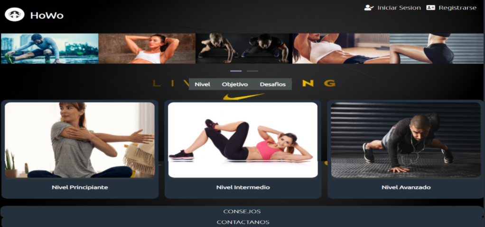

# Aplicación web para rutinas de ejercicios

Bienvenidos a esta aplicacion de rutinas de ejercicios

## Contenido

1. [Características](#sec1)  
2. [Ver la aplicación](#sec2) 
3. [Cómo instalar localmente?](#sec3) 
4. [Integrantes del proyecto](#sec4) 
    4.1. [Equipo de desarrollo](#sec4.1) 
    4.2. [Equipo de control de calidad](#sec4.2) 
5. [Contactos](#sec5) 
    5.1. [Project manager del equipo de desarrollo](#sec5.1) 
    5.2. [Project manager del equipo de control de calidad](#sec5.2) 

## Características

* ⚙️ Modo en linea : Funciona con acceso a internet para poder ver los videos en youtube.
* ⚙️ Creacion de cuenta : Solo necesitas un correo electrónico.
* ⚙️ Olvido de contraseña : Recupera tu contraseña en caso de olvido.
* ❤️ Favorito : Realiza los ejercios con pause de video.
* ❤️ Favorito : Realiza los ejercios viendo un gif.
* ❤️ Favorito : Acceso a las diferentes rutinas tan solo con la creación de una cuenta gratuita.
* ❤️ Favorito : Cuenta con un apartado de visualizción de progreso.

## Ver la aplicación

Este proyecto fue realizado por un grupo de estudiantes de las carrearas de Ingeniería Informática y Sistemas de la Universidad Mayor de San Simón como proyecto semestral de la materia de Ingeniería de Software.

## Cómo instalar localmente?

1. Clone este repositorio : `$ git clone https://github.com/Home-Workout/HoWo`
2. Vaya a la carpeta y ejecute `ejecutelo en google chrome`
3. Una vez ejecutado el proyecto ya puede empezar a acceder a la aplicación

## Integrantes del proyecto
El total de los integrantes son 12: 6 DEV y 6 QA

## Equipo de desarrollo

* Alborta Colque José Fabricio
* Claros Alvarez Damaris
* Iporre Medrano Andres Eloy
* Llojlla Charca  Josias
* Nogales Villarroel Rafael
* Vargas Cruz Jose Manuel

## Equipo de control de calidad

* Aiza Colque Maribel
* Arnez Ponce Clever
* Carreño Huaipara Alejandro Rai
* Montero Ramiro
* Valencia Arguellez Víctor Hugo Samir
* Vargas Condori Luis Fernando

## Contactos

Si tienes alguna duda o sugerencias aquí te dejamos los correros electrónicos de los encargados del proyecto.

## Project manager del equipo de desarrollo
*  andresiporre@gmail.com

## Project manager del equipo de control de calidad
* maribel@gmail.com